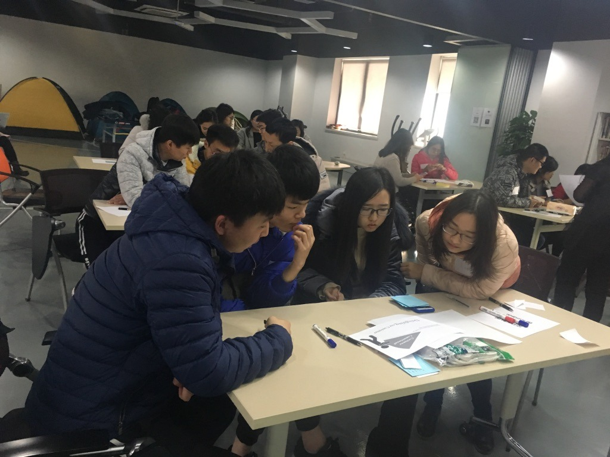
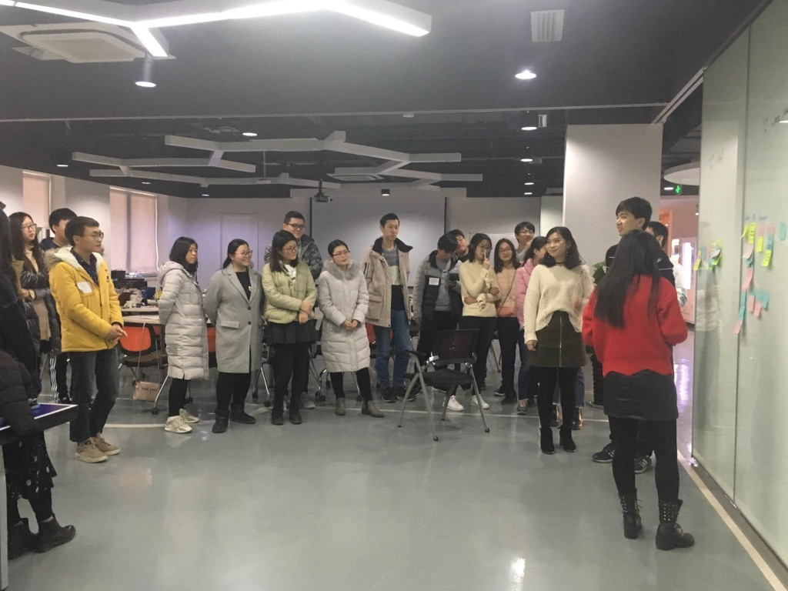

# ThoughtWorks_2017_12_23

[TOC]

## Warm up Welcome

- **随机分组自我介绍游戏**：6人一组，每个人自我介绍后，后一个人需先重复前面所有人说的话，最后说自己的自我介绍，如果不能完整的说完，需从第一个人重新自我介绍，目的是帮助小伙伴快速认识对方。
- **团体小游戏**：所有人分成两组，大家围成圈，面朝外背朝里互相挽着胳膊坐下，比赛内容是在开始后看那队首先全体队员先站起来。说起来简单做起来难，首先大家很容易站的比较松但是坐下就发现很挤，其次是大家在起来的时候，由于是胳膊挽着胳膊，起来的时候会互相牵绊左右的人，其实非常想站起来，可是左右的人会拉着你，越急越站不起来。这个游戏除了告诉我们团队合作的重要性，我觉得还有需要大家相互协作，需要耐心和信心，团队里的每个人都很重要，因为最终是需要大家都要站起来，需要我们互相搀扶，才能到达胜利的终点。也许可以有一两个小伙伴来喊个123什么的，大家好齐心协力，也许还需要一点点小方法，比如报数的单数人先站起来，隔两三秒双数人再站起来。

## Culture

- 社会责任感
- 优秀的人（passion、open、自我驱动）
- 不可妥协的原则
- 客户意识
- 全球化
- 企业家精神
- 乐趣

## Agile Methodology
常卉

- **瀑布模型**：是第一个软件工程方法
- **原型模型**：是为了解决瀑布模型的缺点
- **增量、螺旋模型**：综合了瀑布模型和原型模型
- **CMM**（能力成熟度模型）：衡量一个过程的成熟度方法
- 软件方法
  > 软件方法就是用来编写计算机程序的一套规则和惯例。
  - **重量级方法**：具有很多规则、惯例、和文档。正确地遵循它们需要训练及时间。
  - **轻量级方法**：仅具有很少的一些规则和惯例，或者说，这些规则和惯例遵守起来很容易。
- **Scrum**：是一个包括了一系列的实践和预定义角色的过程骨架（是一种流程、计划、模式，用于有效率地开发软件）。
- **XP**（Extreme Programming，极限编程）（需求卡有优先级）

## Presentation Tips

**Effective Presentation**
- show your passion and connect with your audience
- focus your audience's needs
- keep it simple：concentrate on your core message
- 眼神交流
- start strongly
- use your voice effectively
- use your body too
- relax，breathe
- prepare，prepare and prepare

## Feedback
@孙菁

- **DIE模型**：Description，Interpretation，Evaluation
- **IIY模型**
- **三圈理论**：Belief(信仰)，Attitude(态度)，Behaviour(行为)
- **如何给feedback**：
  - 首先询问对方，能否给feedback
  - 尽早
  - 这是两个人的事情
  - 需要心理上安全的环境
  - No aggression，态度温和
  - 不要一次给太多feedback（积极向上）

## Review

回顾之前所讲的内容

## Retro

收集大家的feedback（好的、不好的、建议），贴在对应的墙上，然后大家一起来看这些feedback，算是一次互相交流感受的过程，之后反馈给对应的人，大家一起变得更好。

## 总结

第一次比较详尽的了解公司的文化（公司文化比较吸引我），第一次发现feedback的重要性和公司的实施方式及注意点，第一次发现公司对与新人的重视、对于“大家共同提高”的重视，不论你处于什么样的技术领域或者水平，只要你积极向上，有成长的意愿，总有大神能带着你提高，总有小伙伴能帮助到你，不要怕失败，快速失败再快速成长。未来加油。